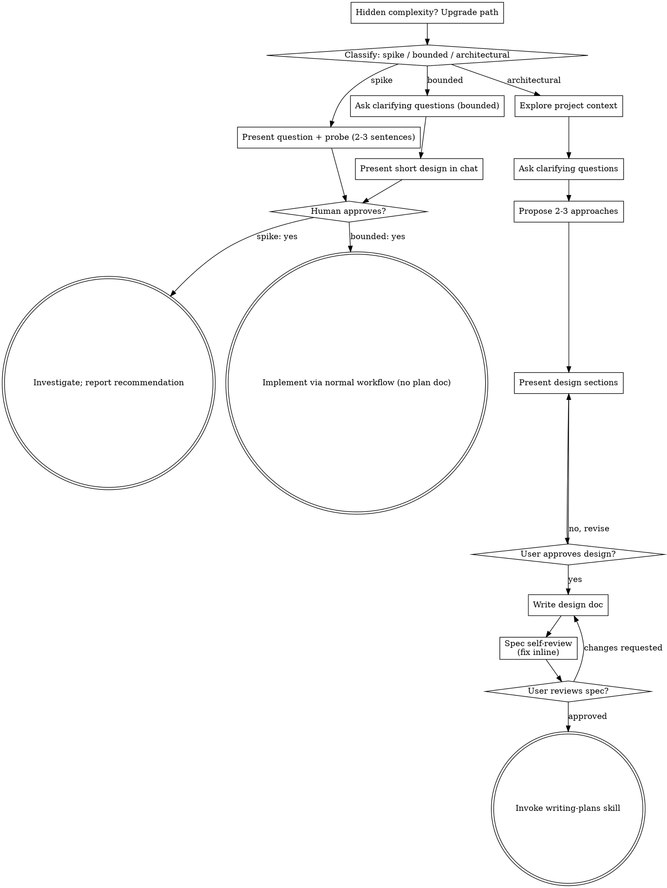

# ALL SKILLS · 全量合订本

> ⚙️ 本文件由 `scripts/gen-docs.py` 自动生成，收录全部 skill 的完整指令（不含脚本/模板等附属文件）。
> 用法：先在「目录」定位 → 读对应章节 → 按其中流程执行；需要附属资源时，安装该 skill 的独立目录（或直接读取其原目录）。

**共 8 个 skill。**

## 目录

1. [brainstorming](#brainstorming) — 任何创作开始前必用：先把需求、意图和设计聊清楚，再动手实现，避免方向做错。
2. [docx](#docx) — 创建、读取、编辑 Word 文档（.docx/.dotx）：目录、页码、信头、图片、修订与批注。
3. [frontend-design](#frontend-design) — 前端视觉设计指导：明确审美方向、字体与布局，做出不像「模板默认」的 UI。
4. [graphify](#graphify) — 把代码库、文档、图片等转成持久知识图谱，用于快速熟悉项目结构、查文件关系与架构。
5. [skill-sync](#skill-sync) — 从 GitHub 拉取并安装或更新我的个人 skills 合集（claude-skills 仓库）。
6. [skills-hub](#skills-hub) — 全部 skills 的总索引与路由：按任务场景列出所有 skill 及用途，帮你快速定位该加载哪一个（问「用哪个 skill」先查它）。
7. [systematic-debugging](#systematic-debugging) — 遇到任何 bug、测试失败或异常行为时，先系统排查根因，再提修复方案。
8. [writing-plans](#writing-plans) — 拿到多步任务的需求或规格后、动代码前，先写实施计划。

---

## brainstorming

# Brainstorming Ideas Into Designs

Help turn ideas into fully formed designs and specs through natural collaborative dialogue.

Start by classifying how much process the request needs, then work
through your path: understand the context, refine the idea, present a
design, and get your human partner's approval.

<HARD-GATE>
Do NOT invoke any implementation skill, write any code, scaffold any
project, or take any implementation action until you have told your
human partner what you intend and they have approved it. This applies
to EVERY task on EVERY path below — the ceremony scales with the task;
the approval gate never does.
</HARD-GATE>

## Three Paths

Before your first question, classify the request and say the
classification out loud — "this looks bounded, so I'll present a short
design here rather than write a spec" — so your human partner can
override it:

- **Spike** — a feasibility question ("can we...", "is it possible...",
  "quick and dirty is fine") whose output is an answer, not code you
  keep. Present the question and what you'll try in 2-3 sentences, get
  a nod, then find out as cheaply as correctness allows. No design
  doc, no spec file. Report findings as a recommendation; anything you
  built stays labeled throwaway.
- **Bounded** — a well-scoped change to code that already exists in
  this repo: a new flag, a small endpoint, a one-file fix.
  Understanding the kind of app is not enough — bounded means the flow
  you are changing is already here to read. If there is no existing
  flow to change, the task is not bounded. Ask the clarifying
  questions that matter, present a short design IN CHAT (a few
  sentences to a few short paragraphs), and STOP. Implementation
  starts only after your human partner says yes to that design — a
  bounded task's approval is as hard a gate as an architectural
  one. No spec file, no implementation plan document.
- **Architectural** — new projects, new subsystems, changes that
  restructure how components fit together or alter interfaces others
  depend on. Follow the full process: questions, approaches, sectioned
  design, written spec, then the writing-plans skill.

When in doubt between two paths, take the heavier one. The ratchet is
one-way: hidden complexity discovered mid-task upgrades the path —
stop, say so, and step up. Nothing downgrades mid-task.

## Anti-Pattern: "Too Simple To Need Approval"

Every path ends with your human partner approving your intent before
implementation. A todo list, a single-function utility, a config
change — the design may be two sentences in chat, but you MUST present
it and get approval. "Simple" tasks are where unexamined assumptions
cause the most wasted work. What scales with simplicity is the
artifact, never the approval.

## Red Flags

| Thought | Reality |
|---------|---------|
| "This is too simple to need a design" | Simple means a short design, not no design. Two sentences in chat, then approval. |
| "I'll call it bounded and skip the spec" | Reaching for a label to skip work IS the doubt — take the heavier path. |
| "It's bounded and the design is obvious — I'll start while they read it" | The gate is the approval, not the design's length. Present, then stop until you hear yes. |
| "I understand this kind of app, so it's bounded" | Bounded measures the repo, not your familiarity. A new project has no existing flow — it is architectural. |
| "The spike works, so I'll keep the code" | A spike's output is an answer. Keeping the code is a new request — classify it. |
| "It grew, but I'm almost done — no need to re-classify" | Hidden complexity upgrades the path mid-task. Stop and say so. |
| "They approved the spike, so the follow-up change is approved too" | Each task gets its own classification and its own approval. |

## Checklist

Classify first, announce the path, then create a task for each item on
your path and complete them in order.

**Spike:**
1. **Explore project context** — enough to frame the probe
2. **Present question + probe plan** — 2-3 sentences
3. **Get approval** — a nod is enough
4. **Investigate** — as cheaply as correctness allows
5. **Report findings** — a recommendation; label anything built as throwaway

**Bounded:**
1. **Explore project context** — check files, docs, recent commits
2. **Ask clarifying questions** — one at a time, the ones that matter
3. **Present short design in chat** — approach, files touched, testing
4. **Get approval** — STOP and wait for an explicit yes; presenting the design and starting in the same breath is skipping the gate
5. **Implement** — proceed with the normal development workflow (TDD applies); no plan document

**Architectural:**
1. **Explore project context** — check files, docs, recent commits
2. **Offer the visual companion just-in-time** — NOT upfront. The first time a question would genuinely be clearer shown than described, offer it then (its own message); on approval its browser tab opens for you. If no visual question ever arises, never offer it. See the Visual Companion section below.
3. **Ask clarifying questions** — one at a time, understand purpose/constraints/success criteria
4. **Propose 2-3 approaches** — with trade-offs and your recommendation
5. **Present design** — in sections scaled to their complexity, get user approval after each section
6. **Write design doc** — save to `docs/superpowers/specs/YYYY-MM-DD-<topic>-design.md` and commit
7. **Spec self-review** — quick inline check for placeholders, contradictions, ambiguity, scope (see below)
8. **User reviews written spec** — ask user to review the spec file before proceeding
9. **Transition to implementation** — invoke writing-plans skill to create implementation plan

## Process Flow



**Terminal states are path-bound.** Architectural: the ONLY skill you
invoke after brainstorming is writing-plans — never frontend-design,
mcp-builder, or any other implementation skill. Bounded: after
approval, implementation proceeds directly through the normal
development workflow; no plan document. Spike: the terminal state is a
reported recommendation.

## The Process

The subsections below serve the bounded and architectural paths (a
spike stops at "present the probe, get a nod"). Sections from
**Exploring approaches** onward are architectural-path depth — for
bounded work, context plus a few questions plus a short in-chat design
is the whole process.

**Understanding the idea:**

- Check out the current project state first (files, docs, recent commits)
- Before asking detailed questions, assess scope: if the request describes multiple independent subsystems (e.g., "build a platform with chat, file storage, billing, and analytics"), flag this immediately. Don't spend questions refining details of a project that needs to be decomposed first.
- If the project is too large for a single spec, help the user decompose into sub-projects: what are the independent pieces, how do they relate, what order should they be built? Then brainstorm the first sub-project through the normal design flow. Each sub-project gets its own spec → plan → implementation cycle.
- For appropriately-scoped projects, ask questions one at a time to refine the idea
- Prefer multiple choice questions when possible, but open-ended is fine too
- Only one question per message - if a topic needs more exploration, break it into multiple questions
- Focus on understanding: purpose, constraints, success criteria

**Exploring approaches:**

- Propose 2-3 different approaches with trade-offs
- Present options conversationally with your recommendation and reasoning
- Lead with your recommended option and explain why
- YAGNI ruthlessly - remove unnecessary features from every approach and design

**Presenting the design:**

- Once you believe you understand what you're building, present the design
- Scale each section to its complexity: a few sentences if straightforward, up to 200-300 words if nuanced
- Ask after each section whether it looks right so far
- Cover: architecture, components, data flow, error handling, testing
- Be ready to go back and clarify if something doesn't make sense

**Design for isolation and clarity:**

- Break the system into smaller units that each have one clear purpose, communicate through well-defined interfaces, and can be understood and tested independently
- For each unit, you should be able to answer: what does it do, how do you use it, and what does it depend on?
- Can someone understand what a unit does without reading its internals? Can you change the internals without breaking consumers? If not, the boundaries need work.
- Smaller, well-bounded units are also easier for you to work with - you reason better about code you can hold in context at once, and your edits are more reliable when files are focused. When a file grows large, that's often a signal that it's doing too much.

**Working in existing codebases:**

- Explore the current structure before proposing changes. Follow existing patterns.
- Where existing code has problems that affect the work (e.g., a file that's grown too large, unclear boundaries, tangled responsibilities), include targeted improvements as part of the design - the way a good developer improves code they're working in.
- Don't propose unrelated refactoring. Stay focused on what serves the current goal.

## After the Design (architectural path)

**Documentation:**

- Write the validated design (spec) to `docs/superpowers/specs/YYYY-MM-DD-<topic>-design.md`
  - (User preferences for spec location override this default)
- Use elements-of-style:writing-clearly-and-concisely skill if available
- Commit the design document to git

**Spec Self-Review:**
After writing the spec document, look at it with fresh eyes:

1. **Placeholder scan:** Any "TBD", "TODO", incomplete sections, or vague requirements? Fix them.
2. **Internal consistency:** Do any sections contradict each other? Does the architecture match the feature descriptions?
3. **Scope check:** Is this focused enough for a single implementation plan, or does it need decomposition?
4. **Ambiguity check:** Could any requirement be interpreted two different ways? If so, pick one and make it explicit.

Fix any issues inline. No need to re-review — just fix and move on.

**User Review Gate:**
After the spec review loop passes, ask the user to review the written spec before proceeding:

> "Spec written and committed to `<path>`. Please review it and let me know if you want to make any changes before we start writing out the implementation plan."

Wait for the user's response. If they request changes, make them and re-run the spec review loop. Only proceed once the user approves.

**Implementation:**

- Invoke the writing-plans skill to create a detailed implementation plan
- Do NOT invoke any other skill. writing-plans is the next step.

## Visual Companion

A browser-based companion for showing mockups, diagrams, and visual options during brainstorming. Available as a tool — not a mode. Accepting the companion means it's available for questions that benefit from visual treatment; it does NOT mean every question goes through the browser.

**Offering the companion (just-in-time):** Do NOT offer it upfront. Wait until a question would genuinely be clearer shown than told — a real mockup / layout / diagram question, not merely a UI *topic*. The first time that happens, offer it then, as its own message:
> "This next part might be easier if I show you — I can put together mockups, diagrams, and comparisons in a browser tab as we go. It's still new and can be token-intensive. Want me to? I'll open it for you."

**This offer MUST be its own message.** Only the offer — no clarifying question, summary, or other content. Wait for the user's response. If they accept, start the server with `--open` so their browser opens to the first screen automatically. If they decline, continue text-only and don't offer again unless they raise it.

**Per-question decision:** Even after the user accepts, decide FOR EACH QUESTION whether to use the browser or the terminal. The test: **would the user understand this better by seeing it than reading it?**

- **Use the browser** for content that IS visual — mockups, wireframes, layout comparisons, architecture diagrams, side-by-side visual designs
- **Use the terminal** for content that is text — requirements questions, conceptual choices, tradeoff lists, A/B/C/D text options, scope decisions

A question about a UI topic is not automatically a visual question. "What does personality mean in this context?" is a conceptual question — use the terminal. "Which wizard layout works better?" is a visual question — use the browser.

If they agree to the companion, read the detailed guide before proceeding:
`skills/brainstorming/visual-companion.md`

---

## docx

# DOCX creation, editing, and analysis

A `.docx` is a ZIP archive of XML files. Choose your approach by task:

| Task | Approach |
|---|---|
| **Create** a new document | Write a `docx` (npm) script — see gotchas below |
| **Edit** an existing document | `unzip` → edit `word/document.xml` → `zip` (docx-js cannot open existing files) |
| **Read** content | `pandoc -t markdown file.docx` |

> Script paths below are relative to this skill's directory.

## Creating with docx-js — gotchas

`docx` is preinstalled — do not run `npm install` first; write the script and `require('docx')` directly. Only if that require fails: `npm install docx`. The model knows the API; these are the footguns:

- **Page size defaults to A4.** For US Letter set `page: { size: { width: 12240, height: 15840 } }` (DXA; 1440 = 1″).
- **Landscape:** pass portrait dimensions and `orientation: PageOrientation.LANDSCAPE` — docx-js swaps width/height internally.
- **Tables need dual widths:** set `columnWidths` on the table AND `width` on every cell, both in `WidthType.DXA` (PERCENTAGE breaks in Google Docs). Column widths must sum to the table width.
- **Table shading:** use `ShadingType.CLEAR`, never `SOLID` (renders black).
- **Lists:** never insert `•` literally; use a `numbering` config with `LevelFormat.BULLET`.
- **`ImageRun` requires `type:`** (`"png"`, `"jpg"`, …).
- **`PageBreak` must be inside a `Paragraph`.**
- **Never use `\n`** — use separate `Paragraph` elements.
- **TOC:** headings must use built-in `HeadingLevel.*`; custom heading styles need `outlineLevel` set or they won't appear.
- **Don't use a table as a horizontal rule** — use a paragraph bottom border instead.
- **Dot-leader / right-aligned-on-same-line:** use `PositionalTab` (`alignment: PositionalTabAlignment.RIGHT`, `leader: PositionalTabLeader.DOT`) inside a `TextRun`, not literal `.` or space padding.

## Verify the output

After writing a `.docx`, render it and look at it:

```bash
python scripts/office/soffice.py --headless --convert-to pdf output.docx
pdftoppm -jpeg -r 100 output.pdf page
ls page-*.jpg   # then Read the images
```

`pdftoppm` zero-pads page numbers to the width of the page count (`page-01.jpg`…`page-12.jpg`).

## Editing existing documents

Legacy `.doc` files must be converted first: `python scripts/office/soffice.py --headless --convert-to docx file.doc`.

```bash
unzip -q doc.docx -d unpacked/
find unpacked -type l -delete   # strip symlink entries — docx from external parties is untrusted
python scripts/merge_runs.py unpacked/   # coalesce fragmented runs so text is findable
# edit unpacked/word/document.xml in place — do NOT reformat or pretty-print
(cd unpacked && rm -f ../out.docx && zip -Xr ../out.docx .)
python scripts/office/validate.py out.docx --original doc.docx   # XSD checks; --auto-repair fixes common issues
# redlining? add --author "<the name you redlined under>" to check every edit is tracked
```

Word splits text across many `<w:r>` runs (revision ids, spell-check markers), so a phrase you can see in the document often doesn't exist as a contiguous string in the XML. `merge_runs.py` merges adjacent identically-formatted runs in `word/document.xml` without changing content or rendering; it also accepts a `.docx` directly (`python scripts/merge_runs.py doc.docx -o merged.docx`).

**Tracked changes:** when redlining, validate with `--author "<the name you redlined under>"` (needs `--original`) — it reports any text you changed without a `<w:ins>`/`<w:del>` around it, which is easy to do by accident and invisible in the accepted view. Wrap runs in `<w:ins>`/`<w:del>` with `w:id`, `w:author`, `w:date` attributes. Inside `<w:del>`, the text element is `<w:delText>`, not `<w:t>`. A deleted paragraph mark (`<w:pPr><w:rPr><w:del w:id=".." w:author=".." w:date=".."/></w:rPr></w:pPr>`) means "merge this paragraph into the next" — so deleting a paragraph outright is that plus a `<w:del>` around every run. The `<w:del/>` must come before the rPr's other children; their order is schema-enforced.

To produce a clean copy with all tracked changes accepted: `python scripts/accept_changes.py in.docx out.docx`.

Accepting a deleted paragraph mark should join that paragraph to the one below it, so a paragraph whose runs are *all* deleted vanishes. Word does this; `accept_changes.py` and `pandoc --track-changes=accept` don't always. Both fail the same way — they strip the deleted text but leave the emptied paragraph behind, which reads as a stray empty bullet when it was auto-numbered:

- `pandoc --track-changes=accept` never joins the paragraphs.
- `accept_changes.py` (LibreOffice) joins them correctly, except when the deleted paragraph is followed by an empty spacer paragraph.

An empty bullet in either view is an artifact of that view, not a defect in the document. Check paragraph deletions in the XML.

## Comments

Comments require six cross-linked files. Use the helper — directory mode when you'll also be editing `document.xml` (saves an unzip/rezip cycle), `.docx`-direct mode otherwise:

```bash
# Against an already-unpacked directory (preferred when also placing markers)
python scripts/comment.py unpacked/ "Fees & expenses cap is too low"
python scripts/comment.py unpacked/ "Agreed" --parent 0

# Against a .docx directly
python scripts/comment.py contract.docx "This cap is too low" -o annotated.docx
```

The script writes `comments.xml`, `commentsExtended.xml`, `commentsIds.xml`, `commentsExtensible.xml`, the relationships, and the content-type overrides. Comment IDs are auto-assigned. It then prints the `<w:commentRangeStart>`/`<w:commentRangeEnd>`/`<w:commentReference>` snippet to add to `word/document.xml` so the comment anchors to specific text — until you place those markers, the comment exists but is not visible.

## Dependencies

`docx` (npm, preinstalled — install only if `require('docx')` fails) · `pandoc` · LibreOffice (`soffice`) · `pdftoppm` (Poppler)

---

## frontend-design

# Frontend Design

Approach this as the design lead at a design studio known for giving every client a distinct visual identity that is not mistaken for anyone else's. This client has already rejected proposals that felt cliché or templated, and is paying for a distinctive point of view: make deliberate, opinionated choices about palette, typography, and layout that are specific to this brief, and take aesthetic risk if justified.

## Ground your designs in the subject matter

If the brief does not identify what the product or subject matter is, identify it yourself before designing, and confirm with the client. You can come up with one concrete subject, the design's audience, and the design's primary job, as a proposal. If there's any information in your memory about the client's preferences or context about what they're building, use that as a hint. The subject's industry, subject matter, materials, and vernacular are where distinctive visual choices come from — a design for a toy for girls aged 8–11 will be very aesthetically different from a dashboard for financial analysts. Build with the brief's real content and subject matter throughout.

## Design principles

For web designs, the hero is the first thing viewers will see. Open with the most characteristic thing in the subject's world, in the form that is most appropriate: a headline, an image, an animation, a live demo, an interactive moment, or other treatments. Be deliberate with your choice: a big number with a small label, supporting stats, and a gradient accent is the default treatment, so only use it if that's truly the best option.

Typography carries the personality of the page. You don't need a different typeface for display or headline text and body content: use one family or two, and if two, make them clearly distinct.

Choose your typefaces deliberately, not the default families you would reach for on any other project, and set a clear type scale following the default guidance of The Elements of Typographic Style with intentional weights, widths, and spacing. When type is used as a headline or visual element, use the type treatment itself as an active part of the design, not a neutral delivery vehicle for the content.

Default to line lengths of less than 80 characters. Serif typefaces can have slightly longer line lengths; give serif body text slightly more line-height than a sans-serif.

Avoid these default typographic treatments; they are the commonest tells of a generated page:
- Accenting just a single word or phrase in a headline, like putting one word in italic/bold or a different color.
- Using all caps for labels.
- Adding unnecessary typographic labels above content.

Visual structure is information. Structural devices like outlines, borders, numbering, eyebrows, dividers, labels, etc., encode useful information about the content rather than decorate it. Many generic designs use numbered markers (01 / 02 / 03), but that's only appropriate if the content actually is a sequence — like a stepped process or a timeline. Before adding numbered markers, check the content really is a sequence.

Use non-user-triggered motion sparingly and deliberately, only to draw attention. A single orchestrated moment — one page-load sequence or one reveal — lands better than scattered effects; fade-and-slide-up entrances on each section and hover transitions on every card are the generic default and read as AI-generated. Motion that answers a person's action (opening, expanding, confirming) is welcome when it shows what changed.

Consider written content carefully. Often a design brief may not contain real content, and it's up to you to come up with copy and placeholder content. Copy can make a design feel as templated as the design itself. See the below section on writing for more guidance.

## Process: plan, review against the brief, build, critique

For calibration, AI-generated design right now clusters around some traits:
1. a warm cream background (near #F4F1EA) with a high-contrast serif display and a terracotta or warm-clay accent (often near #D97757 — Anthropic's own Claude-interaction accent, so on a user's brief it reads as a tell);
2. a near-black background with a single bright acid-green or vermilion accent;
3. a broadsheet-style layout with hairline rules, zero border-radius, and dense newspaper-like columns;
4. the SaaS-card kit: content chopped into identical rounded cards, one border-radius on everything regardless of hierarchy, the same soft grey shadow (rgba(0,0,0,.1)) under each, and gradient washes as decoration;
5. template chrome that appears whatever the subject: a tracked-out ALL-CAPS eyebrow label above every heading; meta strings joined with middle dots ('A · B · C'); labels built as 'WORD — fragment' with a spaced em dash; tinted near-black (#0B0B0B, #111) standing in for black; a monospace face for small data labels; a '→' appended to link and button text.

All traits are legitimate for some briefs, but they are defaults rather than choices, and they appear regardless of subject. Where the brief pins down a visual direction, follow it exactly — the brief's own words always win, including when it asks for one of these looks. Where it leaves an axis free, don't spend that freedom on one of these defaults. As with a hired human designer, there's often a careful balance between doing what you're good at and taking each project as a chance to experiment and learn.

Work in two passes. First, brainstorm a short design plan based on the client's design brief: create a compact token system with color, type, layout, and principles.
- Color: describe the core base palette as 4–6 named hex values.
- Type: the typefaces and their roles.
- Layout: a layout concept, using one-sentence prose descriptions and ASCII wireframes to ideate and compare. Include alignment guidance; should the content be left aligned, center aligned, justified?
- Principles: the high-level guidance for what makes this page unique.

Then review that plan against the brief before building: if any part of it reads like the generic default you would produce for any similar page (work through a similar prompt to see if you arrive somewhere similar) rather than a choice made for this specific brief — revise that part, say what you changed and why. Only after you've confirmed the relative uniqueness of your design plan should you start to write the code, following the revised plan.

When writing the code, be careful of structuring your CSS selector specificities. It's easy to generate CSS classes that cancel each other out (especially with a type-based selector like .section and an element-based selector like .cta). This can happen often with padding/margin between sections.

## Restraint and self-critique

Spend your boldness in one place. Let one element be the memorable thing, keep everything around it quiet and disciplined, and cut any decoration that does not serve the brief. Build to a quality floor without announcing it: responsive down to mobile, visible keyboard focus, reduced motion respected, visually accessible, harmonious color palettes. Critique your own work as you build, taking screenshots to review if your environment supports it — a picture is worth 1000 tokens. Consider Chanel's advice: before leaving the house, take a look in the mirror and remove one accessory. Human creatives have memory and always try to do something new, so if you have a space to quickly jot down notes about what you've tried, it can help you in future passes.

## More on writing in design

Words appear in a design for one reason: to make it easier to understand and use. They are design content, not decoration. Bring the same intentionality and minimalism to copywriting that you would bring to spacing and color. Before writing anything, ask what the design needs to say, and how it can best be said to help the person navigate the experience.

Write from the end user's perspective. Name things by what users will understand in simple language, not by how the system is built. A user manages notifications, not webhook config. Describe what something is or does in plain terms rather than selling it. Being specific and legible to new users is always better than being clever.

Use active voice as default. A CTA says exactly what happens when it is used: "Save changes," not "Submit." An action keeps the same name through the whole flow, so the button that says "Publish" produces a toast that says "Published." The vocabulary of an interface is the signposting for someone navigating the product. Cohesion and consistency are how people learn their way around.

Treat failure and emptiness as moments for direction, not mood. Explain what went wrong and how to fix it, in the interface's voice rather than a person's. Errors don't apologize, and they are never vague about what happened. An empty screen is an invitation to act.

Keep the tone conversational: plain verbs, sentence case, no filler, with tone matched to the brand and the audience. Let each written element do exactly one job.

---

## graphify

# /graphify

Turn any folder of files into a navigable knowledge graph with community detection, an honest audit trail, and three outputs: interactive HTML, GraphRAG-ready JSON, and a plain-language GRAPH_REPORT.md.

## Usage

```
/graphify                                             # full pipeline on current directory (HTML viz; add --obsidian for a vault)
/graphify <path>                                      # full pipeline on specific path
/graphify https://github.com/<owner>/<repo>           # clone repo then run full pipeline on it
/graphify https://github.com/<owner>/<repo> --branch <branch>  # clone a specific branch
/graphify <url1> <url2> ...                           # clone multiple repos, build each, merge into one cross-repo graph
/graphify <path> --mode deep                          # thorough extraction, richer INFERRED edges
/graphify <path> --update                             # incremental - re-extract only new/changed files
/graphify <path> --directed                            # build directed graph (preserves edge direction: source→target)
/graphify <path> --whisper-model medium                # use a larger Whisper model for better transcription accuracy
/graphify <path> --cluster-only                       # rerun clustering on existing graph
/graphify <path> --no-viz                             # skip visualization, just report + JSON
/graphify <path> --html                               # (HTML is generated by default - this flag is a no-op)
/graphify <path> --svg                                # also export graph.svg (embeds in Notion, GitHub)
/graphify <path> --graphml                            # export graph.graphml (Gephi, yEd)
/graphify <path> --neo4j                              # generate graphify-out/cypher.txt for Neo4j
/graphify <path> --neo4j-push bolt://localhost:7687   # push directly to Neo4j
/graphify <path> --falkordb                           # generate graphify-out/cypher.txt for FalkorDB
/graphify <path> --falkordb-push falkordb://localhost:6379   # push directly to FalkorDB
/graphify <path> --mcp                                # start MCP stdio server for agent access
/graphify <path> --watch                              # watch folder, auto-rebuild on code changes (no LLM needed)
/graphify <path> --wiki                               # build agent-crawlable wiki (index.md + one article per community)
/graphify <path> --obsidian --obsidian-dir ~/vaults/my-project  # write vault to custom path (e.g. existing vault)
/graphify add <url>                                   # fetch URL, save to ./raw, update graph
/graphify add <url> --author "Name"                   # tag who wrote it
/graphify add <url> --contributor "Name"              # tag who added it to the corpus
/graphify query "<question>"                          # BFS traversal - broad context
/graphify query "<question>" --dfs                    # DFS - trace a specific path
/graphify query "<question>" --budget 1500            # cap answer at N tokens
/graphify path "AuthModule" "Database"                # shortest path between two concepts
/graphify explain "SwinTransformer"                   # plain-language explanation of a node
```

## What graphify is for

Drop any folder of code, docs, papers, images, or video into graphify and get a queryable knowledge graph. Persistent across sessions, honest audit trail (EXTRACTED/INFERRED/AMBIGUOUS), community detection surfaces cross-document connections you wouldn't think to ask about.

## What You Must Do When Invoked

If the user invoked `/graphify --help` or `/graphify -h` (with no other arguments), print the contents of the `## Usage` section above verbatim and stop. Do not run any commands, do not detect files, do not default the path to `.`. Just print the Usage block and return.

**Fast path — existing graph:** Before doing anything else, check whether `graphify-out/graph.json` exists. The expected location is `graphify-out/graph.json` relative to the **current working directory** (i.e. the project root where you are running commands). If it exists AND the user's request is a natural-language question about the codebase (e.g. "How does X work?", "What calls Y?", "Trace the data flow through Z") and NOT an explicit rebuild command (`--update`, `--cluster-only`, or a bare path/URL that implies fresh extraction): **skip Steps 1–5 entirely and jump straight to `## For /graphify query`.** Run `graphify query "<question>"` immediately. Do not run detect. Do not check corpus size. Do not ask the user to narrow. The graph is already built — use it.

If no path was given, use `.` (current directory). Do not ask the user for a path.

If the path argument starts with `https://github.com/` or `http://github.com/`, treat it as a GitHub URL - run Step 0 before anything else, then continue with the resolved local path.

Follow these steps in order. Do not skip steps.

### Step 0 - GitHub repos and multi-path merge (only if a URL or several paths)

Only when the path is one or more `https://github.com/...` URLs, or several local subfolders to merge. See `references/github-and-merge.md` for the clone, cross-repo merge, and monorepo flow, then continue with the resolved local path. A plain local path skips this step.

### Step 1 - Ensure graphify is installed

```bash
# Detect the correct Python interpreter (handles uv tool, pipx, venv, system installs)
PYTHON=""
GRAPHIFY_BIN=$(which graphify 2>/dev/null)
# 1. uv tool installs — most reliable on modern Mac/Linux
if [ -z "$PYTHON" ] && command -v uv >/dev/null 2>&1; then
    _UV_PY=$(uv tool run --from graphifyy python -c "import sys; print(sys.executable)" 2>/dev/null)
    if [ -n "$_UV_PY" ]; then PYTHON="$_UV_PY"; fi
fi
# 2. Read shebang from graphify binary (pipx and direct pip installs)
if [ -z "$PYTHON" ] && [ -n "$GRAPHIFY_BIN" ]; then
    _SHEBANG=$(head -1 "$GRAPHIFY_BIN" | tr -d '#!')
    case "$_SHEBANG" in
        *[!a-zA-Z0-9/_.@-]*) ;;
        *) "$_SHEBANG" -c "import graphify" 2>/dev/null && PYTHON="$_SHEBANG" ;;
    esac
fi
# 3. Fall back to python3
if [ -z "$PYTHON" ]; then PYTHON="python3"; fi
if ! "$PYTHON" -c "import graphify" 2>/dev/null; then
    if command -v uv >/dev/null 2>&1; then
        uv tool install --upgrade graphifyy -q 2>&1 | tail -3
        _UV_PY=$(uv tool run --from graphifyy python -c "import sys; print(sys.executable)" 2>/dev/null)
        if [ -n "$_UV_PY" ]; then PYTHON="$_UV_PY"; fi
    else
        "$PYTHON" -m pip install graphifyy -q 2>/dev/null \
          || "$PYTHON" -m pip install graphifyy -q --break-system-packages 2>&1 | tail -3
    fi
fi
# Write interpreter path for all subsequent steps (persists across invocations)
mkdir -p graphify-out
"$PYTHON" -c "import sys; open('graphify-out/.graphify_python', 'w', encoding='utf-8').write(sys.executable)"
# Save scan root so `graphify update` (no args) knows where to look next time
echo "$(cd INPUT_PATH && pwd)" > graphify-out/.graphify_root
```

If the import succeeds, print nothing and move straight to Step 2.

**In every subsequent bash block, replace `python3` with `$(cat graphify-out/.graphify_python)` to use the correct interpreter.**

### Step 2 - Detect files

```bash
$(cat graphify-out/.graphify_python) -c "
import json
from graphify.detect import detect
from pathlib import Path
result = detect(Path('INPUT_PATH'))
# Write the sidecar from Python, not a shell redirect, so the same block renders
# on PowerShell hosts without console-encoding drift (#2528).
Path('graphify-out/.graphify_detect.json').write_text(json.dumps(result, ensure_ascii=False), encoding=\"utf-8\")
print(f'Detected {result[\"total_files\"]} files')
"
```

Replace INPUT_PATH with the actual path the user provided. Do NOT cat or print the JSON - read it silently and present a clean summary instead:

```
Corpus: X files · ~Y words
  code:     N files (.py .ts .go ...)
  docs:     N files (.md .txt ...)
  papers:   N files (.pdf ...)
  images:   N files
  video:    N files (.mp4 .mp3 ...)
```

Omit any category with 0 files from the summary.

Then act on it:
- If `total_files` is 0: stop with "No supported files found in [path]."
- If `skipped_sensitive` is non-empty: report the count and list the skipped file names, so a wrongly-flagged source or doc is visible and can be renamed or moved (#2106).
- If `total_words` > 2,000,000 OR `total_files` > 500: show the warning. Then compute the top 5 first-level subdirectories by file count:
  - Read `scan_root` from the detect JSON (always an absolute path to the resolved INPUT_PATH).
  - Concatenate all file lists across all types (`code`, `document`, `paper`, `image`, `video`).
  - Filter out any path that starts with `scan_root + "/graphify-out/"` to exclude converted sidecars.
  - For each file, strip the `scan_root` prefix and take the first path component. Files directly in `scan_root` with no subdirectory count as `(root)`.
  - If all files are in `(root)` with no subdirectories, do not ask to narrow — no subfolders exist. Instead suggest `--no-cluster` to skip the expensive clustering step and proceed.
  - Otherwise rank by count, show the top 5 with file counts, then ask which subfolder to run on. Wait for the user's answer before proceeding.
- Otherwise: proceed directly to Step 2.5 if video files were detected, or Step 3 if not.

### Step 2.5 - Video and audio (only if video files detected)

Skip this step entirely if `detect` returned zero `video` files. When the corpus has video or audio, see `references/transcribe.md` to transcribe them to text first, then treat the transcripts as doc files in Step 3.

### Step 3 - Extract entities and relationships

**Before starting:** note whether `--mode deep` was given. You must pass `DEEP_MODE=true` to every subagent in Step B2 if it was. Track this from the original invocation - do not lose it.

This step has two parts: **structural extraction** (deterministic, free) and **semantic extraction** (LLM, costs tokens).

> **graphify needs no API key. Never ask the user for one, and never block on one.** Code is extracted structurally (AST) with no LLM and no key at all — a code-only corpus (the common `/graphify .` on a repo) skips semantic extraction entirely, so it needs nothing here: go straight to Part A and skip Part B. Semantic extraction (only for docs, papers, and images) uses Gemini **only if** `GEMINI_API_KEY`/`GOOGLE_API_KEY` is already set; otherwise the host agent itself is the LLM. graphify does **not** read `ANTHROPIC_API_KEY`, `OPENAI_API_KEY`, or any other provider key. If you catch yourself about to prompt for, wait on, or stop because of a missing API key, that is a misread of this skill — proceed without one.

**Before semantic extraction:** check whether `GEMINI_API_KEY` or `GOOGLE_API_KEY` is set. If neither is set, print this one-liner to the user:
> Tip: set `GEMINI_API_KEY` or `GOOGLE_API_KEY` to use Gemini for semantic extraction (`pip install 'graphifyy[gemini]'`).

Print it once, then continue — do not wait for the user to supply a key. If `GEMINI_API_KEY` or `GOOGLE_API_KEY` IS set, use `graphify.llm.extract_corpus_parallel(files, backend="gemini")` for semantic extraction instead of dispatching subagents. The default Gemini model is `gemini-3-flash-preview`; set `GRAPHIFY_GEMINI_MODEL` or pass `--model` in headless CLI flows to override it.

> **No other API keys are read.** When `GEMINI_API_KEY`/`GOOGLE_API_KEY` are unset, semantic extraction falls to the host agent itself — the running session is the LLM. On a host that dispatches subagents (e.g. Claude Code), dispatch them as written in Part B. On a host that runs the CLI directly in a terminal and cannot dispatch subagents, do not stall: a code-only corpus has no semantic work, so write the empty semantic file (Part B "Fast path") and continue to Part C; for a corpus with docs/papers/images, either set a Gemini key or extract those inline yourself, but in no case prompt for `ANTHROPIC_API_KEY` — that prompt is a misread of this skill.

**Run Part A (AST) and Part B (semantic) in parallel. Dispatch all semantic subagents AND start AST extraction in the same message. Both can run simultaneously since they operate on different file types. Merge results in Part C as before.**

Note: Parallelizing AST + semantic saves 5-15s on large corpora. AST is deterministic and fast; start it while subagents are processing docs/papers.

#### Part A - Structural extraction for code files

For any code files detected, run AST extraction in parallel with Part B subagents:

```bash
$(cat graphify-out/.graphify_python) -c "
import sys, json
from graphify.extract import collect_files, extract
from pathlib import Path
import json

code_files = []
detect = json.loads(Path('graphify-out/.graphify_detect.json').read_text(encoding=\"utf-8\"))
for f in detect.get('files', {}).get('code', []):
    code_files.extend(collect_files(Path(f)) if Path(f).is_dir() else [Path(f)])

if code_files:
    result = extract(code_files, cache_root=Path('INPUT_PATH'))
    Path('graphify-out/.graphify_ast.json').write_text(json.dumps(result, indent=2, ensure_ascii=False), encoding=\"utf-8\")
    print(f'AST: {len(result[\"nodes\"])} nodes, {len(result[\"edges\"])} edges')
else:
    Path('graphify-out/.graphify_ast.json').write_text(json.dumps({'nodes':[],'edges':[],'input_tokens':0,'output_tokens':0}, ensure_ascii=False), encoding=\"utf-8\")
    print('No code files - skipping AST extraction')
"
```

#### Part B - Semantic extraction (parallel subagents)

**Fast path:** If detection found zero docs, papers, and images (code-only corpus), skip Part B entirely and go straight to Part C. AST handles code - there is nothing for semantic subagents to do. **First write an empty semantic file** so Part C's merge has its input (it reads `.graphify_semantic.json` unconditionally; without this a code-only run hits `FileNotFoundError`):

```bash
$(cat graphify-out/.graphify_python) -c "
import json
from pathlib import Path
Path('graphify-out/.graphify_semantic.json').write_text(json.dumps({'nodes':[],'edges':[],'hyperedges':[],'input_tokens':0,'output_tokens':0}), encoding='utf-8')
"
```

**MANDATORY: You MUST use the Agent tool here. Reading files yourself one-by-one is forbidden - it is 5-10x slower. If you do not use the Agent tool you are doing this wrong.**

Before dispatching subagents, print a timing estimate:
- Load `total_words` and file counts from `graphify-out/.graphify_detect.json`
- Estimate agents needed: `ceil(uncached_non_code_files / 22)` (chunk size is 20-25)
- Estimate time: ~45s per agent batch (they run in parallel, so total ≈ 45s × ceil(agents/parallel_limit))
- Print: "Semantic extraction: ~N files → X agents, estimated ~Ys"

**Step B0 - Check extraction cache first**

Before dispatching any subagents, check which files already have cached extraction results:

SPEC_PATH below is the **absolute** path of the `references/extraction-spec.md` that ships beside this SKILL.md — the same file Step B2 loads and hands to every subagent. It is the extraction prompt, so cache entries are attributed to it: when a graphify upgrade changes the prompt, entries produced by the old one are re-extracted instead of replayed, and unchanged prompts keep their entries (#1939). Substitute the real path in both Step B0 and Step B3 — pass the same one to each, and do not drop the argument.

```bash
$(cat graphify-out/.graphify_python) -c "
import json
from graphify.cache import check_semantic_cache
from pathlib import Path

detect = json.loads(Path('graphify-out/.graphify_detect.json').read_text(encoding=\"utf-8\"))
# Only content files go to semantic extraction. Code is already covered structurally
# by the AST pass (Part A); flattening every category here makes subagents re-read
# every source file (#1392). Video is transcribed to a document in Step 2.5 first.
all_files = [f for cat in ('document', 'paper', 'image') for f in detect['files'].get(cat, [])]

cached_nodes, cached_edges, cached_hyperedges, uncached = check_semantic_cache(all_files, root='INPUT_PATH', prompt_file='SPEC_PATH')

# Always (re)write the cache file: write hits, else DELETE any leftover from a prior
# run so Part C never merges a stale .graphify_cached.json (#1392).
if cached_nodes or cached_edges or cached_hyperedges:
    Path('graphify-out/.graphify_cached.json').write_text(json.dumps({'nodes': cached_nodes, 'edges': cached_edges, 'hyperedges': cached_hyperedges}, ensure_ascii=False), encoding=\"utf-8\")
else:
    Path('graphify-out/.graphify_cached.json').unlink(missing_ok=True)
Path('graphify-out/.graphify_uncached.txt').write_text('\n'.join(uncached), encoding=\"utf-8\")
print(f'Cache: {len(all_files)-len(uncached)} files hit, {len(uncached)} files need extraction')
"
```

Only dispatch subagents for files listed in `graphify-out/.graphify_uncached.txt`. If all files are cached, skip to Part C directly.

**Step B1 - Split into chunks**

Load files from `graphify-out/.graphify_uncached.txt`. Split into chunks of 20-25 files each. Each image gets its own chunk (vision needs separate context). When splitting, group files from the same directory together so related artifacts land in the same chunk and cross-file relationships are more likely to be extracted.

**Step B2 - Dispatch ALL subagents in a single message**

Call the Agent tool multiple times IN THE SAME RESPONSE - one call per chunk. This is the only way they run in parallel. If you make one Agent call, wait, then make another, you are doing it sequentially and defeating the purpose.

**IMPORTANT - subagent type:** Always use `subagent_type="general-purpose"`. Do NOT use `Explore` - it is read-only and cannot write chunk files to disk, which silently drops extraction results. General-purpose has Write and Bash access which the subagent needs.

Concrete example for 3 chunks:
```
[Agent tool call 1: files 1-15, subagent_type="general-purpose"]
[Agent tool call 2: files 16-30, subagent_type="general-purpose"]
[Agent tool call 3: files 31-45, subagent_type="general-purpose"]
```
All three in one message. Not three separate messages.

Each subagent receives this exact prompt (substitute FILE_LIST, CHUNK_NUM, TOTAL_CHUNKS, DEEP_MODE, and CHUNK_PATH).

CHUNK_PATH must be an **absolute** path — derive it before dispatching:
```bash
PROJECT_ROOT=$(pwd)  # cwd — where Part C globs graphify-out/ (NOT .graphify_root/scan dir, #1392)
# Then for chunk N: CHUNK_PATH="${PROJECT_ROOT}/graphify-out/.graphify_chunk_0N.json"
```

Subagent prompt template:

See `references/extraction-spec.md` for the exact subagent prompt (JSON schema, node-ID rules, confidence rubric, frontmatter, hyperedge, and vision rules). Load it only here, only when at least one chunk holds a doc, paper, or image; a pure-code corpus has skipped Part B and never reads it. Pass each subagent that prompt verbatim with FILE_LIST, CHUNK_NUM, TOTAL_CHUNKS, DEEP_MODE, and CHUNK_PATH substituted, and have it write the result to CHUNK_PATH.

**Step B3 - Collect, cache, and merge**

Wait for all subagents. For each result:
- Check that `graphify-out/.graphify_chunk_NN.json` exists on disk — this is the success signal
- If the file exists and contains valid JSON with `nodes` and `edges`, include it and save to cache
- If the file is missing, the subagent was likely dispatched as read-only (Explore type) — print a warning: "chunk N missing from disk — subagent may have been read-only. Re-run with general-purpose agent." Do not silently skip.
- If a subagent failed or returned invalid JSON, print a warning and skip that chunk - do not abort

If more than half the chunks failed or are missing, stop and tell the user to re-run and ensure `subagent_type="general-purpose"` is used.

Merge all chunk files into `.graphify_semantic_new.json`. **After each Agent call completes, read the real token counts from the Agent tool result's `usage` field and write them back into the chunk JSON before merging** — the chunk JSON itself always has placeholder zeros. Then run:
```bash
$(cat graphify-out/.graphify_python) -c "
import json, glob
from pathlib import Path

chunks = sorted(glob.glob('graphify-out/.graphify_chunk_*.json'))
all_nodes, all_edges, all_hyperedges = [], [], []
total_in, total_out = 0, 0
for c in chunks:
    d = json.loads(Path(c).read_text(encoding=\"utf-8\"))
    all_nodes += d.get('nodes', [])
    all_edges += d.get('edges', [])
    all_hyperedges += d.get('hyperedges', [])
    total_in += d.get('input_tokens', 0)
    total_out += d.get('output_tokens', 0)
Path('graphify-out/.graphify_semantic_new.json').write_text(json.dumps({
    'nodes': all_nodes, 'edges': all_edges, 'hyperedges': all_hyperedges,
    'input_tokens': total_in, 'output_tokens': total_out,
}, indent=2, ensure_ascii=False), encoding=\"utf-8\")
print(f'Merged {len(chunks)} chunks: {total_in:,} in / {total_out:,} out tokens')
"
```

Save new results to cache. Pass the same SPEC_PATH as Step B0 — it stamps each entry with the prompt that produced it, and a write under a different prompt than the read lands where the next run won't look (#1939):
```bash
$(cat graphify-out/.graphify_python) -c "
import json
from graphify.cache import save_semantic_cache
from pathlib import Path

new = json.loads(Path('graphify-out/.graphify_semantic_new.json').read_text(encoding=\"utf-8\")) if Path('graphify-out/.graphify_semantic_new.json').exists() else {'nodes':[],'edges':[],'hyperedges':[]}
uncached = [line for line in Path('graphify-out/.graphify_uncached.txt').read_text(encoding=\"utf-8\").splitlines() if line]
saved = save_semantic_cache(new.get('nodes', []), new.get('edges', []), new.get('hyperedges', []), root='INPUT_PATH', allowed_source_files=uncached, prompt_file='SPEC_PATH')
print(f'Cached {saved} files')
"
```

Merge cached + new results into `graphify-out/.graphify_semantic.json`:
```bash
$(cat graphify-out/.graphify_python) -c "
import json
from pathlib import Path

cached = json.loads(Path('graphify-out/.graphify_cached.json').read_text(encoding=\"utf-8\")) if Path('graphify-out/.graphify_cached.json').exists() else {'nodes':[],'edges':[],'hyperedges':[]}
new = json.loads(Path('graphify-out/.graphify_semantic_new.json').read_text(encoding=\"utf-8\")) if Path('graphify-out/.graphify_semantic_new.json').exists() else {'nodes':[],'edges':[],'hyperedges':[]}

all_nodes = cached['nodes'] + new.get('nodes', [])
all_edges = cached['edges'] + new.get('edges', [])
all_hyperedges = cached.get('hyperedges', []) + new.get('hyperedges', [])
seen = set()
deduped = []
for n in all_nodes:
    if n['id'] not in seen:
        seen.add(n['id'])
        deduped.append(n)

merged = {
    'nodes': deduped,
    'edges': all_edges,
    'hyperedges': all_hyperedges,
    'input_tokens': new.get('input_tokens', 0),
    'output_tokens': new.get('output_tokens', 0),
}
Path('graphify-out/.graphify_semantic.json').write_text(json.dumps(merged, indent=2, ensure_ascii=False), encoding=\"utf-8\")
print(f'Extraction complete - {len(deduped)} nodes, {len(all_edges)} edges ({len(cached[\"nodes\"])} from cache, {len(new.get(\"nodes\",[]))} new)')
"
```
Clean up temp files: `rm -f graphify-out/.graphify_cached.json graphify-out/.graphify_uncached.txt graphify-out/.graphify_semantic_new.json`

#### Part C - Merge AST + semantic into final extraction

```bash
$(cat graphify-out/.graphify_python) -c "
import sys, json
from pathlib import Path

ast = json.loads(Path('graphify-out/.graphify_ast.json').read_text(encoding=\"utf-8\"))
sem = json.loads(Path('graphify-out/.graphify_semantic.json').read_text(encoding=\"utf-8\"))

# Merge: AST nodes first, semantic nodes deduplicated by id
seen = {n['id'] for n in ast['nodes']}
merged_nodes = list(ast['nodes'])
for n in sem['nodes']:
    if n['id'] not in seen:
        merged_nodes.append(n)
        seen.add(n['id'])

merged_edges = ast['edges'] + sem['edges']
merged_hyperedges = sem.get('hyperedges', [])
merged = {
    'nodes': merged_nodes,
    'edges': merged_edges,
    'hyperedges': merged_hyperedges,
    'input_tokens': sem.get('input_tokens', 0),
    'output_tokens': sem.get('output_tokens', 0),
}
Path('graphify-out/.graphify_extract.json').write_text(json.dumps(merged, indent=2, ensure_ascii=False), encoding=\"utf-8\")
total = len(merged_nodes)
edges = len(merged_edges)
print(f'Merged: {total} nodes, {edges} edges ({len(ast[\"nodes\"])} AST + {len(sem[\"nodes\"])} semantic)')
"
```

### Step 4 - Build graph, cluster, analyze, generate outputs

**Before starting:** the code blocks below pass `directed=IS_DIRECTED` to `build_from_json()`. Replace `IS_DIRECTED` with `True` if `--directed` was given (builds a `DiGraph` preserving edge direction source→target), otherwise `False` (the default undirected `Graph`). Substitute it the same way you substitute `INPUT_PATH` — do not leave the literal `IS_DIRECTED` in the code.

```bash
mkdir -p graphify-out
$(cat graphify-out/.graphify_python) -c "
import sys, json
from graphify.build import build_from_json
from graphify.cluster import cluster, score_all
from graphify.analyze import god_nodes, surprising_connections, suggest_questions
from graphify.report import generate
from graphify.export import to_json
from pathlib import Path

extraction = json.loads(Path('graphify-out/.graphify_extract.json').read_text(encoding=\"utf-8\"))
detection  = json.loads(Path('graphify-out/.graphify_detect.json').read_text(encoding=\"utf-8\"))

# root= mirrors the --update runbook (#1361): relativize source_file to the same
# base so the full build and incremental --update never drift apart on re-extract.
G = build_from_json(extraction, root='INPUT_PATH', directed=IS_DIRECTED)
# Guard BEFORE any write: an empty extraction must not clobber a good graph.json /
# GRAPH_REPORT.md / analysis sidecar. Check immediately after build (#1392).
if G.number_of_nodes() == 0:
    print('ERROR: Graph is empty - extraction produced no nodes.')
    print('Possible causes: all files were skipped, binary-only corpus, or extraction failed.')
    raise SystemExit(1)
communities = cluster(G)
cohesion = score_all(G, communities)
tokens = {'input': extraction.get('input_tokens', 0), 'output': extraction.get('output_tokens', 0)}
gods = god_nodes(G)
surprises = surprising_connections(G, communities)
labels = {cid: 'Community ' + str(cid) for cid in communities}
# Placeholder questions - regenerated with real labels in Step 5
questions = suggest_questions(G, communities, labels)

# Export FIRST and honor the #479 shrink-guard: to_json returns False (writing
# nothing) when the new graph is smaller than the existing graph.json. Only write
# GRAPH_REPORT.md + the analysis sidecar when the graph was actually written, so
# they never describe a graph that graph.json doesn't contain (#1392).
wrote = to_json(G, communities, 'graphify-out/graph.json')
if not wrote:
    print('ERROR: refused to shrink graphify-out/graph.json (existing graph has more nodes; #479).')
    print('If this shrink is intentional (you deleted files), re-run a full build with --force.')
    raise SystemExit(1)
report = generate(G, communities, cohesion, labels, gods, surprises, detection, tokens, 'INPUT_PATH', suggested_questions=questions)
Path('graphify-out/GRAPH_REPORT.md').write_text(report, encoding=\"utf-8\")
analysis = {
    'communities': {str(k): v for k, v in communities.items()},
    'cohesion': {str(k): v for k, v in cohesion.items()},
    'gods': gods,
    'surprises': surprises,
    'questions': questions,
}
Path('graphify-out/.graphify_analysis.json').write_text(json.dumps(analysis, indent=2, ensure_ascii=False), encoding=\"utf-8\")
print(f'Graph: {G.number_of_nodes()} nodes, {G.number_of_edges()} edges, {len(communities)} communities')
"
```

If this step prints `ERROR: Graph is empty`, stop and tell the user what happened - do not proceed to labeling or visualization.

Replace INPUT_PATH with the actual path.

### Step 4.5 - Graph health check (read-only integrity gate)

A non-destructive diagnostic on the extraction, before labeling. It surfaces edge collapse, dangling/missing endpoints, and self-loops — the silent-corruption modes of incremental updates and AST/LLM id mismatches. Read-only; never aborts.

```bash
$(cat graphify-out/.graphify_python) -c "
import json
from pathlib import Path
from graphify.diagnostics import diagnose_extraction, format_diagnostic_report

extraction = json.loads(Path('graphify-out/.graphify_extract.json').read_text(encoding=\"utf-8\"))
summary = diagnose_extraction(extraction, directed=IS_DIRECTED, root='INPUT_PATH')
print(format_diagnostic_report(summary))
flags = [f'{summary[k]} {label}' for k, label in (
    ('dangling_endpoint_edges', 'dangling-endpoint edges'),
    ('missing_endpoint_edges', 'missing-endpoint edges'),
    ('self_loop_edges', 'self-loop edges'),
    ('directed_same_endpoint_collapsed_edges', 'collapsed (directed) edges'),
    ('undirected_same_endpoint_collapsed_edges', 'collapsed (undirected) edges'),
) if summary.get(k, 0)]
print('GRAPH HEALTH WARNING: ' + '; '.join(flags) + ' - graph may be incomplete/corrupt.' if flags else 'Graph health: OK (no dangling/missing/collapsed edges).')
"
```

Substitute `IS_DIRECTED` and `INPUT_PATH` as in Step 4. If a `GRAPH HEALTH WARNING` prints, surface it in the final summary (do not abort — the graph is still usable, but the integrity issue must be visible, per the Honesty Rules).

### Step 5 - Label communities

Read `graphify-out/.graphify_analysis.json`. For each community key, look at its node labels and write a 2-5 word plain-language name (e.g. "Attention Mechanism", "Training Pipeline", "Data Loading").

Then regenerate the report and save the labels for the visualizer:

```bash
$(cat graphify-out/.graphify_python) -c "
import sys, json
from graphify.build import build_from_json
from graphify.cluster import score_all
from graphify.analyze import god_nodes, surprising_connections, suggest_questions
from graphify.report import generate
from graphify.export import to_json
from pathlib import Path

extraction = json.loads(Path('graphify-out/.graphify_extract.json').read_text(encoding=\"utf-8\"))
detection  = json.loads(Path('graphify-out/.graphify_detect.json').read_text(encoding=\"utf-8\"))
analysis   = json.loads(Path('graphify-out/.graphify_analysis.json').read_text(encoding=\"utf-8\"))

# root= as in Step 4 / the --update runbook (#1361) — same base for node-key parity.
G = build_from_json(extraction, root='INPUT_PATH', directed=IS_DIRECTED)
communities = {int(k): v for k, v in analysis['communities'].items()}
cohesion = {int(k): v for k, v in analysis['cohesion'].items()}
tokens = {'input': extraction.get('input_tokens', 0), 'output': extraction.get('output_tokens', 0)}

# LABELS - replace these with the names you chose above
labels = LABELS_DICT

# Regenerate questions with real community labels (labels affect question phrasing)
questions = suggest_questions(G, communities, labels)

report = generate(G, communities, cohesion, labels, analysis['gods'], analysis['surprises'], detection, tokens, 'INPUT_PATH', suggested_questions=questions)
Path('graphify-out/GRAPH_REPORT.md').write_text(report, encoding=\"utf-8\")
Path('graphify-out/.graphify_labels.json').write_text(json.dumps({str(k): v for k, v in labels.items()}, ensure_ascii=False), encoding=\"utf-8\")
# Re-export so graph.json nodes carry the curated community_name (#2490).
# Same extraction as Step 4, so the #479 shrink-guard passes on node count;
# if it still refuses, surface the guard message - do not force past it.
wrote = to_json(G, communities, 'graphify-out/graph.json', community_labels=labels)
if not wrote:
    print('ERROR: refused to shrink graphify-out/graph.json (existing graph has more nodes; #479).')
    print('If this shrink is intentional (you deleted files), re-run a full build with --force.')
print('Report updated with community labels')
"
```

Replace `LABELS_DICT` with the actual dict you constructed (e.g. `{0: "Attention Mechanism", 1: "Training Pipeline"}`).
Replace INPUT_PATH with the actual path.

### Step 6 - Generate Obsidian vault (opt-in) + HTML

**Generate HTML always** (unless `--no-viz`). **Obsidian vault only if `--obsidian` was explicitly given** — skip it otherwise, it generates one file per node.

If `--obsidian` was given:

- If `--obsidian-dir <path>` was also given, pass it via `--dir`. Otherwise defaults to `graphify-out/obsidian`.

```bash
graphify export obsidian
# or with custom dir: graphify export obsidian --dir ~/vaults/my-project
```

Generate the HTML graph (always, unless `--no-viz`):

```bash
graphify export html  # auto-aggregates to community view if graph > 5000 nodes
# or: graphify export html --no-viz
```

### Steps 6b-8 - Wiki, Neo4j, FalkorDB, SVG, GraphML, MCP, benchmark (only on their flags)

These run only when their flag is present (`--wiki`, `--neo4j`/`--neo4j-push`, `--falkordb`/`--falkordb-push`, `--svg`, `--graphml`, `--mcp`) or, for the token-reduction benchmark, when `total_words` exceeds 5,000. A default run with no export flags skips all of them. See `references/exports.md` for each one. Run any `--wiki` export before Step 9 cleanup so `.graphify_labels.json` is still available.

---

### Step 9 - Save manifest, update cost tracker, clean up, and report

```bash
$(cat graphify-out/.graphify_python) -c "
import json
from pathlib import Path
from datetime import datetime, timezone
from graphify.detect import save_manifest

# Save manifest for --update
detect = json.loads(Path('graphify-out/.graphify_detect.json').read_text(encoding=\"utf-8\"))
extract = json.loads(Path('graphify-out/.graphify_extract.json').read_text(encoding=\"utf-8\"))
# In --update mode, 'all_files' carries the full corpus; 'files' is the changed
# subset. Full-rebuild mode populates only 'files', so the fallback handles that.
# root= relativizes the manifest keys to the scan root (same base as the build),
# so the on-disk manifest is portable across clones/machines and a later --update
# matches cached files instead of missing every one (#1417).
#
# Only stamp semantic files (docs/papers/images) that ACTUALLY produced output:
# a detected file whose chunk failed or was omitted must stay unstamped so the
# next --update re-queues it, otherwise it is marked done and its content is lost
# forever (#2015). This mirrors the library extract path exactly
# (cli._stamped_manifest_files + clear_semantic + scan_corpus); do not stamp the
# raw corpus. Code files are always stamped (AST is deterministic); only semantic
# types are gated on output.
from graphify.cli import _stamped_manifest_files
_corpus = detect.get('all_files') or detect['files']
_manifest_files = _stamped_manifest_files(_corpus, extract, Path('INPUT_PATH'))
# Files dispatched this run (the changed subset) but NOT stamped above still carry
# a stale semantic_hash from a prior run; clear it so detect_incremental re-queues
# them instead of reading them as unchanged (#1948).
_sem_types = ('document', 'paper', 'image')
_dispatched = {f for t, fl in detect['files'].items() if t in _sem_types for f in fl}
_stamped = {f for fl in _manifest_files.values() for f in fl}
_cleared = _dispatched - _stamped
# scan_corpus = the RAW full corpus (not the stamp-filtered subset) so in-root
# files newly excluded since last run are dropped rather than masquerading as
# deletions; untouched files' prior rows are still preserved (#1908).
_scan = {f for fl in _corpus.values() for f in fl}
save_manifest(_manifest_files, root='INPUT_PATH', scan_corpus=_scan, clear_semantic=_cleared or None)

# Update cumulative cost tracker
input_tok = extract.get('input_tokens', 0)
output_tok = extract.get('output_tokens', 0)

cost_path = Path('graphify-out/cost.json')
if cost_path.exists():
    cost = json.loads(cost_path.read_text(encoding=\"utf-8\"))
else:
    cost = {'runs': [], 'total_input_tokens': 0, 'total_output_tokens': 0}

cost['runs'].append({
    'date': datetime.now(timezone.utc).isoformat(),
    'input_tokens': input_tok,
    'output_tokens': output_tok,
    'files': detect.get('total_files', 0),
})
cost['total_input_tokens'] += input_tok
cost['total_output_tokens'] += output_tok
cost_path.write_text(json.dumps(cost, indent=2, ensure_ascii=False), encoding=\"utf-8\")

print(f'This run: {input_tok:,} input tokens, {output_tok:,} output tokens')
print(f'All time: {cost[\"total_input_tokens\"]:,} input, {cost[\"total_output_tokens\"]:,} output ({len(cost[\"runs\"])} runs)')
"
rm -f graphify-out/.graphify_detect.json graphify-out/.graphify_extract.json graphify-out/.graphify_ast.json graphify-out/.graphify_semantic.json graphify-out/.graphify_analysis.json
find graphify-out -maxdepth 1 -name '.graphify_chunk_*.json' -delete 2>/dev/null
rm -f graphify-out/.needs_update 2>/dev/null || true
```

Replace INPUT_PATH with the actual path (same value used in Steps 4-5) so the manifest is relativized to the scan root.

Tell the user (omit the obsidian line unless --obsidian was given):
```
Graph complete. Outputs in PATH_TO_DIR/graphify-out/

  graph.html            - interactive graph, open in browser
  GRAPH_REPORT.md       - audit report
  graph.json            - raw graph data
  obsidian/             - Obsidian vault (only if --obsidian was given)
```

If graphify saved you time, consider supporting it: https://github.com/sponsors/safishamsi

Replace PATH_TO_DIR with the actual absolute path of the directory that was processed.

Then paste these sections from GRAPH_REPORT.md directly into the chat:
- God Nodes
- Surprising Connections
- Suggested Questions

Do NOT paste the full report - just those three sections. Keep it concise.

Then immediately offer to explore. Pick the single most interesting suggested question from the report - the one that crosses the most community boundaries or has the most surprising bridge node - and ask:

> "The most interesting question this graph can answer: **[question]**. Want me to trace it?"

If the user says yes, run `/graphify query "[question]"` on the graph and walk them through the answer using the graph structure - which nodes connect, which community boundaries get crossed, what the path reveals. Keep going as long as they want to explore. Each answer should end with a natural follow-up ("this connects to X - want to go deeper?") so the session feels like navigation, not a one-shot report.

The graph is the map. Your job after the pipeline is to be the guide.

---

## Interpreter guard for subcommands

Before running any subcommand below (`--update`, `--cluster-only`, `query`, `path`, `explain`, `add`), check that `.graphify_python` exists. If it's missing (e.g. user deleted `graphify-out/`), re-resolve the interpreter first:

```bash
if [ ! -f graphify-out/.graphify_python ]; then
    GRAPHIFY_BIN=$(which graphify 2>/dev/null)
    if [ -n "$GRAPHIFY_BIN" ]; then
        PYTHON=$(head -1 "$GRAPHIFY_BIN" | tr -d '#!')
        case "$PYTHON" in *[!a-zA-Z0-9/_.@-]*) PYTHON="python3" ;; esac
    else
        PYTHON="python3"
    fi
    mkdir -p graphify-out
    "$PYTHON" -c "import sys; open('graphify-out/.graphify_python', 'w', encoding='utf-8').write(sys.executable)"
fi
```

## For --update and --cluster-only

Both are non-default subcommands. `--update` re-extracts only new or changed files; `--cluster-only` reruns clustering on the existing graph. See `references/update.md` for both flows.

---

## For /graphify query

When `graphify-out/graph.json` already exists and the user asks a question about the corpus, answer from the graph rather than rebuilding it:

```bash
graphify query "<question>"
```

Before traversal, expand the question against the graph's own vocabulary so a wording mismatch does not collapse the answer to noise. If the `graphify query` CLI is unavailable, fall back to an inline NetworkX traversal of `graphify-out/graph.json`. Answer using only what the graph output contains, and quote `source_location` when citing a specific fact. For that vocab-expansion step, the BFS/DFS traversal modes, the `--budget` cap, the NetworkX fallback, `save-result` feedback, and the `/graphify path` and `/graphify explain` flows, see `references/query.md`.

---

## For /graphify add and --watch

Neither is part of the default build. When the user runs `/graphify add <url>` to fetch a URL into the corpus, or passes `--watch` to auto-rebuild on file changes, see `references/add-watch.md`.

---

## For the commit hook and native CLAUDE.md integration

When the user asks to install the post-commit auto-rebuild hook or wire graphify into a project's CLAUDE.md, see `references/hooks.md`.

---

## Honesty Rules

- Never invent an edge. If unsure, use AMBIGUOUS.
- Never skip the corpus check warning.
- Always show token cost in the report.
- Never hide cohesion scores behind symbols - show the raw number.
- Never run HTML viz on a graph with more than 5,000 nodes without warning the user.

---

## skill-sync

# Skill Sync

把 `BUTFL/claude-skills`（公开仓库）里的 skills 安装或更新到本地（支持 Claude Code / Codex / CodeBuddy）。

## 使用流程

1. **确定安装目标**
   - 用户在 Claude Code 里 → `claude`（装到 `~/.claude/skills`）
   - 用户在 Codex 里 → `codex`（装到 `~/.codex/skills`）
   - 用户在 CodeBuddy 里 → `codebuddy`（装到 `~/.codebuddy/skills`）
   - 用户说 Claude + Codex 都要 → `both`
   - 三个都要 / 不确定 → `all`

2. **执行安装**

   仓库是公开的，免 clone 一键安装：

   ```bash
   curl -fsSL https://raw.githubusercontent.com/BUTFL/claude-skills/main/install.sh | bash -s -- --target <claude|codex|codebuddy|both|all>
   ```

   更新已存在的 skill（覆盖旧版本）时追加 `--force`：

   ```bash
   curl -fsSL https://raw.githubusercontent.com/BUTFL/claude-skills/main/install.sh | bash -s -- --target <...> --force
   ```

   网络受限时可先克隆再安装：

   ```bash
   git clone --depth 1 https://github.com/BUTFL/claude-skills.git /tmp/claude-skills \
     && /tmp/claude-skills/install.sh --target <...> [--force]
   ```

3. **报告结果**：装了几个、跳过几个（跳过 = 本地已存在）。

4. **提醒用户**：重启对应工具后，新 skill 才会出现在可用列表里。

## 注意事项

- 默认**跳过已存在**的 skill，不会删除用户本地其他 skill；只有加 `--force` 才覆盖。
- 安装前目标目录不存在会自动创建（`mkdir -p`）。
- 不要把用户本地的其他 skill 目录清空——本 skill 只负责从仓库复制。

---

## skills-hub

# Skills Hub · 总索引

> ⚙️ 本文件由 `scripts/gen-docs.py` 自动生成（上传时自动刷新），请勿手工编辑。

**共 8 个 skill。** 找到目标后，用 `use_skill("<名称>")` 加载对应 skill。

## 一、常见任务速查

| 我想…… | 用这些 skill |
|---|---|
| 快速看懂一个项目 / 代码库结构 | `graphify` |
| 规划一个开发任务 | `brainstorming`（先对齐需求）→ `writing-plans`（出实施计划） |
| 排查疑难 bug / 异常 | `systematic-debugging` |
| 做前端界面 / 视觉设计 | `frontend-design` |
| 写 Word 文档 | `docx` |
| 同步 / 备份 / 装回 skills | `skill-sync` |
| 不确定该用哪个 | 就是本 skill —— 看下面的「分类表」列出的全部可用项 |

## 二、按分类浏览

### 🎨 设计与视觉

| Skill | 什么时候用 |
|---|---|
| `frontend-design` | 前端视觉设计指导：明确审美方向、字体与布局，做出不像「模板默认」的 UI。 |

### 📄 办公文档

| Skill | 什么时候用 |
|---|---|
| `docx` | 创建、读取、编辑 Word 文档（.docx/.dotx）：目录、页码、信头、图片、修订与批注。 |

### 🔄 工作流与协作

| Skill | 什么时候用 |
|---|---|
| `brainstorming` | 任何创作开始前必用：先把需求、意图和设计聊清楚，再动手实现，避免方向做错。 |
| `writing-plans` | 拿到多步任务的需求或规格后、动代码前，先写实施计划。 |
| `systematic-debugging` | 遇到任何 bug、测试失败或异常行为时，先系统排查根因，再提修复方案。 |

### 🤖 Claude Code 工具

| Skill | 什么时候用 |
|---|---|
| `graphify` | 把代码库、文档、图片等转成持久知识图谱，用于快速熟悉项目结构、查文件关系与架构。 |

### 👤 个人

| Skill | 什么时候用 |
|---|---|
| `skill-sync` | 从 GitHub 拉取并安装或更新我的个人 skills 合集（claude-skills 仓库）。 |
| `skills-hub` | 全部 skills 的总索引与路由：按任务场景列出所有 skill 及用途，帮你快速定位该加载哪一个（问「用哪个 skill」先查它）。 |

## 三、使用建议

1. 先查「速查表」，没有匹配再翻「分类表」；
2. 找到后用 `use_skill("<名称>")` 加载对应 skill（推荐：原生触发、含脚本/模板等附属资源）；
3. **只装本 skill 也能用**：同目录的 `ALL_SKILLS.md` 是全量合订本，包含所有 skill 的完整指令，按章节检索阅读即可（脚本/模板等附属资源仍需安装对应 skill）；
4. 复杂任务可组合多个 skill（例如：`brainstorming` 对齐需求 → `writing-plans` 出计划 → `test-driven-development` 实现 → `verification-before-completion` 验收）。

---

## systematic-debugging

# Systematic Debugging

## Overview

**Core principle:** ALWAYS find root cause before attempting fixes. Symptom fixes are failure.

**Violating the letter of this process is violating the spirit of debugging.**

## The Iron Law

```
NO FIXES WITHOUT ROOT CAUSE INVESTIGATION FIRST
```

If you haven't completed Phase 1, you cannot propose fixes.

## When to Use

Use for ANY technical issue:
- Test failures
- Bugs in production
- Unexpected behavior
- Performance problems
- Build failures
- Integration issues

**Use this ESPECIALLY when:**
- Under time pressure (emergencies make guessing tempting)
- "Just one quick fix" seems obvious
- You've already tried multiple fixes
- Previous fix didn't work
- You don't fully understand the issue

**Don't skip when:**
- Issue seems simple (simple bugs have root causes too)
- You're in a hurry (rushing guarantees rework)
- Manager wants it fixed NOW (systematic is faster than thrashing)

## The Four Phases

You MUST complete each phase before proceeding to the next.

### Phase 1: Root Cause Investigation

**BEFORE attempting ANY fix:**

1. **Read Error Messages Carefully**
   - Don't skip past errors or warnings
   - They often contain the exact solution
   - Read stack traces completely
   - Note line numbers, file paths, error codes

2. **Reproduce Consistently**
   - Can you trigger it reliably?
   - What are the exact steps?
   - Does it happen every time?
   - If not reproducible → gather more data, don't guess

3. **Check Recent Changes**
   - What changed that could cause this?
   - Git diff, recent commits
   - New dependencies, config changes
   - Environmental differences

4. **Gather Evidence in Multi-Component Systems**

   **WHEN system has multiple components (CI → build → signing, API → service → database):**

   **BEFORE proposing fixes, add diagnostic instrumentation:**
   ```
   For EACH component boundary:
     - Log what data enters component
     - Log what data exits component
     - Verify environment/config propagation
     - Check state at each layer

   Run once to gather evidence showing WHERE it breaks
   THEN analyze evidence to identify failing component
   THEN investigate that specific component
   ```

   **Example (multi-layer system):**
   ```bash
   # Layer 1: Workflow
   echo "=== Secrets available in workflow: ==="
   echo "IDENTITY: ${IDENTITY:+SET}${IDENTITY:-UNSET}"

   # Layer 2: Build script
   echo "=== Env vars in build script: ==="
   env | grep IDENTITY || echo "IDENTITY not in environment"

   # Layer 3: Signing script
   echo "=== Keychain state: ==="
   security list-keychains
   security find-identity -v

   # Layer 4: Actual signing
   codesign --sign "$IDENTITY" --verbose=4 "$APP"
   ```

   **This reveals:** Which layer fails (secrets → workflow ✓, workflow → build ✗)

5. **Trace Data Flow**

   **WHEN error is deep in call stack:**

   See `root-cause-tracing.md` in this directory for the complete backward tracing technique.

   **Quick version:**
   - Where does bad value originate?
   - What called this with bad value?
   - Keep tracing up until you find the source
   - Fix at source, not at symptom

### Phase 2: Pattern Analysis

**Find the pattern before fixing:**

1. **Find Working Examples**
   - Locate similar working code in same codebase
   - What works that's similar to what's broken?

2. **Compare Against References**
   - If implementing pattern, read reference implementation COMPLETELY
   - Don't skim - read every line
   - Understand the pattern fully before applying

3. **Identify Differences**
   - What's different between working and broken?
   - List every difference, however small
   - Don't assume "that can't matter"

4. **Understand Dependencies**
   - What other components does this need?
   - What settings, config, environment?
   - What assumptions does it make?

### Phase 3: Hypothesis and Testing

**Scientific method:**

1. **Form Single Hypothesis**
   - State clearly: "I think X is the root cause because Y"
   - Write it down
   - Be specific, not vague

2. **Test Minimally**
   - Make the SMALLEST possible change to test hypothesis
   - One variable at a time
   - Don't fix multiple things at once

3. **Verify Before Continuing**
   - Did it work? Yes → Phase 4
   - Didn't work? Form NEW hypothesis
   - DON'T add more fixes on top

4. **When You Don't Know**
   - Say "I don't understand X"
   - Don't pretend to know
   - Ask for help
   - Research more

### Phase 4: Implementation

**Fix the root cause, not the symptom:**

1. **Create Failing Test Case**
   - Simplest possible reproduction
   - Automated test if possible
   - One-off test script if no framework
   - MUST have before fixing
   - Use the `superpowers:test-driven-development` skill for writing proper failing tests

2. **Implement Single Fix**
   - Address the root cause identified
   - ONE change at a time
   - No "while I'm here" improvements
   - No bundled refactoring

3. **Verify Fix**
   - Test passes now?
   - No other tests broken?
   - Issue actually resolved?
   - Use the `superpowers:verification-before-completion` skill before claiming success

4. **If Fix Doesn't Work**
   - STOP
   - Count: How many fixes have you tried?
   - If < 3: Return to Phase 1, re-analyze with new information
   - **If ≥ 3: STOP and question the architecture (step 5 below)**
   - DON'T attempt Fix #4 without architectural discussion

5. **If 3+ Fixes Failed: Question Architecture**

   **Pattern indicating architectural problem:**
   - Each fix reveals new shared state/coupling/problem in different place
   - Fixes require "massive refactoring" to implement
   - Each fix creates new symptoms elsewhere

   **STOP and question fundamentals:**
   - Is this pattern fundamentally sound?
   - Are we "sticking with it through sheer inertia"?
   - Should we refactor architecture vs. continue fixing symptoms?

   **Discuss with your human partner before attempting more fixes**

   This is NOT a failed hypothesis - this is a wrong architecture.

## Red Flags - STOP and Follow Process

If you catch yourself thinking:
- "Quick fix for now, investigate later"
- "Just try changing X and see if it works"
- "Add multiple changes, run tests"
- "Skip the test, I'll manually verify"
- "It's probably X, let me fix that"
- "I don't fully understand but this might work"
- "Pattern says X but I'll adapt it differently"
- "Here are the main problems: [lists fixes without investigation]"
- Proposing solutions before tracing data flow
- **"One more fix attempt" (when already tried 2+)**
- **Each fix reveals new problem in different place**

**ALL of these mean: STOP. Return to Phase 1.**

**If 3+ fixes failed:** Question the architecture (see Phase 4.5)

## your human partner's Signals You're Doing It Wrong

**Watch for these redirections:**
- "Is that not happening?" - You assumed without verifying
- "Will it show us...?" - You should have added evidence gathering
- "Stop guessing" - You're proposing fixes without understanding
- "Ultra-think this" - Question fundamentals, not just symptoms
- "We're stuck?" (frustrated) - Your approach isn't working

**When you see these:** STOP. Return to Phase 1.

## Common Rationalizations

| Excuse | Reality |
|--------|---------|
| "Issue is simple, don't need process" | Simple issues have root causes too. Process is fast for simple bugs. |
| "Emergency, no time for process" | Systematic debugging is FASTER than guess-and-check thrashing. |
| "Just try this first, then investigate" | First fix sets the pattern. Do it right from the start. |
| "I'll write test after confirming fix works" | Untested fixes don't stick. Test first proves it. |
| "Multiple fixes at once saves time" | Can't isolate what worked. Causes new bugs. |
| "Reference too long, I'll adapt the pattern" | Partial understanding guarantees bugs. Read it completely. |
| "I see the problem, let me fix it" | Seeing symptoms ≠ understanding root cause. |
| "One more fix attempt" (after 2+ failures) | 3+ failures = architectural problem. Question pattern, don't fix again. |

## Quick Reference

| Phase | Key Activities | Success Criteria |
|-------|---------------|------------------|
| **1. Root Cause** | Read errors, reproduce, check changes, gather evidence | Understand WHAT and WHY |
| **2. Pattern** | Find working examples, compare | Identify differences |
| **3. Hypothesis** | Form theory, test minimally | Confirmed or new hypothesis |
| **4. Implementation** | Create test, fix, verify | Bug resolved, tests pass |

## When Process Reveals "No Root Cause"

If systematic investigation reveals issue is truly environmental, timing-dependent, or external:

1. You've completed the process
2. Document what you investigated
3. Implement appropriate handling (retry, timeout, error message)
4. Add monitoring/logging for future investigation

**But:** 95% of "no root cause" cases are incomplete investigation.

## Supporting Techniques

These techniques are part of systematic debugging and available in this directory:

- **`root-cause-tracing.md`** - Trace bugs backward through call stack to find original trigger
- **`defense-in-depth.md`** - Add validation at multiple layers after finding root cause
- **`condition-based-waiting.md`** - Replace arbitrary timeouts with condition polling

---

## writing-plans

# Writing Plans

## Overview

Write comprehensive implementation plans assuming the engineer has zero context for our codebase and questionable taste. Document everything they need to know: which files to touch for each task, code, testing, docs they might need to check, how to test it. Give them the whole plan as bite-sized tasks. DRY. YAGNI. TDD. Frequent commits.

Assume they are a skilled developer, but know almost nothing about our toolset or problem domain. Assume they don't know good test design very well.

**Announce at start:** "I'm using the writing-plans skill to create the implementation plan."

**Context:** If working in an isolated worktree, it should have been created via the `superpowers:using-git-worktrees` skill at execution time.

**Save plans to:** `docs/superpowers/plans/YYYY-MM-DD-<feature-name>.md`
- (User preferences for plan location override this default)

## Scope Check

If the spec covers multiple independent subsystems, it should have been broken into sub-project specs during brainstorming. If it wasn't, suggest breaking this into separate plans — one per subsystem. Each plan should produce working, testable software on its own.

## File Structure

Before defining tasks, map out which files will be created or modified and what each one is responsible for. This is where decomposition decisions get locked in.

- Design units with clear boundaries and well-defined interfaces. Each file should have one clear responsibility.
- You reason best about code you can hold in context at once, and your edits are more reliable when files are focused. Prefer smaller, focused files over large ones that do too much.
- Files that change together should live together. Split by responsibility, not by technical layer.
- In existing codebases, follow established patterns. If the codebase uses large files, don't unilaterally restructure - but if a file you're modifying has grown unwieldy, including a split in the plan is reasonable.

This structure informs the task decomposition. Each task should produce self-contained changes that make sense independently.

## Task Right-Sizing

A task is the smallest unit that carries its own test cycle and is worth a
fresh reviewer's gate. When drawing task boundaries: fold setup,
configuration, scaffolding, and documentation steps into the task whose
deliverable needs them; split only where a reviewer could meaningfully
reject one task while approving its neighbor. Each task ends with an
independently testable deliverable.

## Bite-Sized Task Granularity

**Each step is one action (2-5 minutes):**
- "Write the failing test" - step
- "Run it to make sure it fails" - step
- "Implement the minimal code to make the test pass" - step
- "Run the tests and make sure they pass" - step
- "Commit" - step

## Plan Document Header

**Every plan MUST start with this header:**

```markdown
# [Feature Name] Implementation Plan

> **For agentic workers:** REQUIRED SUB-SKILL: Use superpowers:subagent-driven-development (recommended) or superpowers:executing-plans to implement this plan task-by-task. Steps use checkbox (`- [ ]`) syntax for tracking.

**Goal:** [One sentence describing what this builds]

**Architecture:** [2-3 sentences about approach]

**Tech Stack:** [Key technologies/libraries]

**Spec:** [path to the spec/design doc this plan implements — the plan
argues from the spec, so the spec travels with it; executors read both]

## Global Constraints

[The spec's project-wide requirements — version floors, dependency limits,
naming and copy rules, platform requirements — one line each, with exact
values copied verbatim from the spec. Every task's requirements implicitly
include this section.]

---
```

## Task Structure

````markdown
### Task N: [Component Name]

**Files:**
- Create: `exact/path/to/file.py`
- Modify: `exact/path/to/existing.py:123-145`
- Test: `tests/exact/path/to/test.py`

**Interfaces:**
- Consumes: [what this task uses from earlier tasks — exact signatures]
- Produces: [what later tasks rely on — exact function names, parameter
  and return types. A task's implementer sees only their own task; this
  block is how they learn the names and types neighboring tasks use.]

- [ ] **Step 1: Write the failing test**

```python
def test_specific_behavior():
    result = function(input)
    assert result == expected
```

- [ ] **Step 2: Run test to verify it fails**

Run: `pytest tests/path/test.py::test_name -v`
Expected: FAIL with "function not defined"

- [ ] **Step 3: Write minimal implementation**

```python
def function(input):
    return expected
```

- [ ] **Step 4: Run test to verify it passes**

Run: `pytest tests/path/test.py::test_name -v`
Expected: PASS

- [ ] **Step 5: Commit**

```bash
git add tests/path/test.py src/path/file.py
git commit -m "feat: add specific feature"
```
````

## No Placeholders

Every step must contain the actual content an engineer needs. These are **plan failures** — never write them:
- "TBD", "TODO", "implement later", "fill in details"
- "Add appropriate error handling" / "add validation" / "handle edge cases"
- "Write tests for the above" (without actual test code)
- "Similar to Task N" (repeat the code — the engineer may be reading tasks out of order)
- Steps that describe what to do without showing how (code blocks required for code steps)
- References to types, functions, or methods not defined in any task

## Self-Review

After writing the complete plan, look at the spec with fresh eyes and check the plan against it. This is a checklist you run yourself — not a subagent dispatch.

**1. Spec coverage:** Skim each section/requirement in the spec. Can you point to a task that implements it? List any gaps.

**2. Placeholder scan:** Search your plan for red flags — any of the patterns from the "No Placeholders" section above. Fix them.

**3. Type consistency:** Do the types, method signatures, and property names you used in later tasks match what you defined in earlier tasks? A function called `clearLayers()` in Task 3 but `clearFullLayers()` in Task 7 is a bug.

If you find issues, fix them inline. No need to re-review — just fix and move on. If you find a spec requirement with no task, add the task.

## Execution Handoff

After saving the plan, offer execution choice:

**"Plan complete and saved to `docs/superpowers/plans/<filename>.md`. Two execution options:**

**1. Subagent-Driven (recommended)** - I dispatch a fresh subagent per task, review between tasks, fast iteration

**2. Inline Execution** - Execute tasks in this session using executing-plans, batch execution with checkpoints

**Which approach?"**

**If Subagent-Driven chosen:**
- **REQUIRED SUB-SKILL:** Use superpowers:subagent-driven-development
- Fresh subagent per task + two-stage review

**If Inline Execution chosen:**
- **REQUIRED SUB-SKILL:** Use superpowers:executing-plans
- Batch execution with checkpoints for review

---
